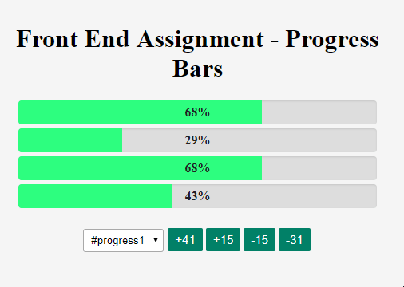

# Frontend Progress Bars using React

<br>



<br>

* Can see a demo at http://saviof.com/progress_bars/

## 

* Built using ReactJS
* Reads data from endpoint using Fetch API [https://github.com/github/fetch]
* Using Babel and webpack to transcompile ES6 
* Using CSSS preprocessing using webpack extrack

## 

Build the project using

```
npm install
npm run build
```
